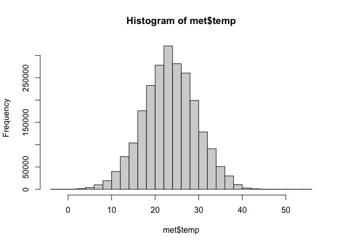

Lab 03
================
Yumeng Gao
2022-09-07

``` r
library(webshot)
webshot::install_phantomjs()
```

    ## It seems that the version of `phantomjs` installed is greater than or equal to the requested version.To install the requested version or downgrade to another version, use `force = TRUE`.

## 1. Read in the data

First download and then read in with data.table:fread()

``` r
library(R.utils)
```

    ## Loading required package: R.oo

    ## Loading required package: R.methodsS3

    ## R.methodsS3 v1.8.2 (2022-06-13 22:00:14 UTC) successfully loaded. See ?R.methodsS3 for help.

    ## R.oo v1.25.0 (2022-06-12 02:20:02 UTC) successfully loaded. See ?R.oo for help.

    ## 
    ## Attaching package: 'R.oo'

    ## The following object is masked from 'package:R.methodsS3':
    ## 
    ##     throw

    ## The following objects are masked from 'package:methods':
    ## 
    ##     getClasses, getMethods

    ## The following objects are masked from 'package:base':
    ## 
    ##     attach, detach, load, save

    ## R.utils v2.12.0 (2022-06-28 03:20:05 UTC) successfully loaded. See ?R.utils for help.

    ## 
    ## Attaching package: 'R.utils'

    ## The following object is masked from 'package:utils':
    ## 
    ##     timestamp

    ## The following objects are masked from 'package:base':
    ## 
    ##     cat, commandArgs, getOption, isOpen, nullfile, parse, warnings

``` r
library(data.table)
library(tidyverse)
```

    ## ── Attaching packages
    ## ───────────────────────────────────────
    ## tidyverse 1.3.2 ──

    ## ✔ ggplot2 3.3.6     ✔ purrr   0.3.4
    ## ✔ tibble  3.1.8     ✔ dplyr   1.0.9
    ## ✔ tidyr   1.2.0     ✔ stringr 1.4.0
    ## ✔ readr   2.1.2     ✔ forcats 0.5.1
    ## ── Conflicts ────────────────────────────────────────── tidyverse_conflicts() ──
    ## ✖ dplyr::between()   masks data.table::between()
    ## ✖ tidyr::extract()   masks R.utils::extract()
    ## ✖ dplyr::filter()    masks stats::filter()
    ## ✖ dplyr::first()     masks data.table::first()
    ## ✖ dplyr::lag()       masks stats::lag()
    ## ✖ dplyr::last()      masks data.table::last()
    ## ✖ purrr::transpose() masks data.table::transpose()

``` r
if (!file.exists("met_all.gz")){
  download.file("https://raw.githubusercontent.com/USCbiostats/data-science-data/master/02_met/met_all.gz", "met_all.gz", method="libcurl", timeout = 60)
}
met <- data.table::fread("met_all.gz")
```

## 2. Check the dimensions, headers, footers. How many columns, rows are there?

``` r
dim(met)
```

    ## [1] 2377343      30

``` r
head(met)
```

    ##    USAFID  WBAN year month day hour min  lat      lon elev wind.dir wind.dir.qc
    ## 1: 690150 93121 2019     8   1    0  56 34.3 -116.166  696      220           5
    ## 2: 690150 93121 2019     8   1    1  56 34.3 -116.166  696      230           5
    ## 3: 690150 93121 2019     8   1    2  56 34.3 -116.166  696      230           5
    ## 4: 690150 93121 2019     8   1    3  56 34.3 -116.166  696      210           5
    ## 5: 690150 93121 2019     8   1    4  56 34.3 -116.166  696      120           5
    ## 6: 690150 93121 2019     8   1    5  56 34.3 -116.166  696       NA           9
    ##    wind.type.code wind.sp wind.sp.qc ceiling.ht ceiling.ht.qc ceiling.ht.method
    ## 1:              N     5.7          5      22000             5                 9
    ## 2:              N     8.2          5      22000             5                 9
    ## 3:              N     6.7          5      22000             5                 9
    ## 4:              N     5.1          5      22000             5                 9
    ## 5:              N     2.1          5      22000             5                 9
    ## 6:              C     0.0          5      22000             5                 9
    ##    sky.cond vis.dist vis.dist.qc vis.var vis.var.qc temp temp.qc dew.point
    ## 1:        N    16093           5       N          5 37.2       5      10.6
    ## 2:        N    16093           5       N          5 35.6       5      10.6
    ## 3:        N    16093           5       N          5 34.4       5       7.2
    ## 4:        N    16093           5       N          5 33.3       5       5.0
    ## 5:        N    16093           5       N          5 32.8       5       5.0
    ## 6:        N    16093           5       N          5 31.1       5       5.6
    ##    dew.point.qc atm.press atm.press.qc       rh
    ## 1:            5    1009.9            5 19.88127
    ## 2:            5    1010.3            5 21.76098
    ## 3:            5    1010.6            5 18.48212
    ## 4:            5    1011.6            5 16.88862
    ## 5:            5    1012.7            5 17.38410
    ## 6:            5    1012.7            5 20.01540

``` r
tail(met)
```

    ##    USAFID  WBAN year month day hour min    lat      lon elev wind.dir
    ## 1: 726813 94195 2019     8  31   18  56 43.650 -116.633  741       NA
    ## 2: 726813 94195 2019     8  31   19  56 43.650 -116.633  741       70
    ## 3: 726813 94195 2019     8  31   20  56 43.650 -116.633  741       NA
    ## 4: 726813 94195 2019     8  31   21  56 43.650 -116.633  741       10
    ## 5: 726813 94195 2019     8  31   22  56 43.642 -116.636  741       10
    ## 6: 726813 94195 2019     8  31   23  56 43.642 -116.636  741       40
    ##    wind.dir.qc wind.type.code wind.sp wind.sp.qc ceiling.ht ceiling.ht.qc
    ## 1:           9              C     0.0          5      22000             5
    ## 2:           5              N     2.1          5      22000             5
    ## 3:           9              C     0.0          5      22000             5
    ## 4:           5              N     2.6          5      22000             5
    ## 5:           1              N     2.1          1      22000             1
    ## 6:           1              N     2.1          1      22000             1
    ##    ceiling.ht.method sky.cond vis.dist vis.dist.qc vis.var vis.var.qc temp
    ## 1:                 9        N    16093           5       N          5 30.0
    ## 2:                 9        N    16093           5       N          5 32.2
    ## 3:                 9        N    16093           5       N          5 33.3
    ## 4:                 9        N    14484           5       N          5 35.0
    ## 5:                 9        N    16093           1       9          9 34.4
    ## 6:                 9        N    16093           1       9          9 34.4
    ##    temp.qc dew.point dew.point.qc atm.press atm.press.qc       rh
    ## 1:       5      11.7            5    1013.6            5 32.32509
    ## 2:       5      12.2            5    1012.8            5 29.40686
    ## 3:       5      12.2            5    1011.6            5 27.60422
    ## 4:       5       9.4            5    1010.8            5 20.76325
    ## 5:       1       9.4            1    1010.1            1 21.48631
    ## 6:       1       9.4            1    1009.6            1 21.48631

## 3. Take a look at the variables.

``` r
str(met)
```

    ## Classes 'data.table' and 'data.frame':   2377343 obs. of  30 variables:
    ##  $ USAFID           : int  690150 690150 690150 690150 690150 690150 690150 690150 690150 690150 ...
    ##  $ WBAN             : int  93121 93121 93121 93121 93121 93121 93121 93121 93121 93121 ...
    ##  $ year             : int  2019 2019 2019 2019 2019 2019 2019 2019 2019 2019 ...
    ##  $ month            : int  8 8 8 8 8 8 8 8 8 8 ...
    ##  $ day              : int  1 1 1 1 1 1 1 1 1 1 ...
    ##  $ hour             : int  0 1 2 3 4 5 6 7 8 9 ...
    ##  $ min              : int  56 56 56 56 56 56 56 56 56 56 ...
    ##  $ lat              : num  34.3 34.3 34.3 34.3 34.3 34.3 34.3 34.3 34.3 34.3 ...
    ##  $ lon              : num  -116 -116 -116 -116 -116 ...
    ##  $ elev             : int  696 696 696 696 696 696 696 696 696 696 ...
    ##  $ wind.dir         : int  220 230 230 210 120 NA 320 10 320 350 ...
    ##  $ wind.dir.qc      : chr  "5" "5" "5" "5" ...
    ##  $ wind.type.code   : chr  "N" "N" "N" "N" ...
    ##  $ wind.sp          : num  5.7 8.2 6.7 5.1 2.1 0 1.5 2.1 2.6 1.5 ...
    ##  $ wind.sp.qc       : chr  "5" "5" "5" "5" ...
    ##  $ ceiling.ht       : int  22000 22000 22000 22000 22000 22000 22000 22000 22000 22000 ...
    ##  $ ceiling.ht.qc    : int  5 5 5 5 5 5 5 5 5 5 ...
    ##  $ ceiling.ht.method: chr  "9" "9" "9" "9" ...
    ##  $ sky.cond         : chr  "N" "N" "N" "N" ...
    ##  $ vis.dist         : int  16093 16093 16093 16093 16093 16093 16093 16093 16093 16093 ...
    ##  $ vis.dist.qc      : chr  "5" "5" "5" "5" ...
    ##  $ vis.var          : chr  "N" "N" "N" "N" ...
    ##  $ vis.var.qc       : chr  "5" "5" "5" "5" ...
    ##  $ temp             : num  37.2 35.6 34.4 33.3 32.8 31.1 29.4 28.9 27.2 26.7 ...
    ##  $ temp.qc          : chr  "5" "5" "5" "5" ...
    ##  $ dew.point        : num  10.6 10.6 7.2 5 5 5.6 6.1 6.7 7.8 7.8 ...
    ##  $ dew.point.qc     : chr  "5" "5" "5" "5" ...
    ##  $ atm.press        : num  1010 1010 1011 1012 1013 ...
    ##  $ atm.press.qc     : int  5 5 5 5 5 5 5 5 5 5 ...
    ##  $ rh               : num  19.9 21.8 18.5 16.9 17.4 ...
    ##  - attr(*, ".internal.selfref")=<externalptr>

## 4. Take a closer look at the key variables.

``` r
table(met$year)
```

    ## 
    ##    2019 
    ## 2377343

``` r
table(met$day)
```

    ## 
    ##     1     2     3     4     5     6     7     8     9    10    11    12    13 
    ## 75975 75923 76915 76594 76332 76734 77677 77766 75366 75450 76187 75052 76906 
    ##    14    15    16    17    18    19    20    21    22    23    24    25    26 
    ## 77852 76217 78015 78219 79191 76709 75527 75786 78312 77413 76965 76806 79114 
    ##    27    28    29    30    31 
    ## 79789 77059 71712 74931 74849

``` r
table(met$hour)
```

    ## 
    ##      0      1      2      3      4      5      6      7      8      9     10 
    ##  99434  93482  93770  96703 110504 112128 106235 101985 100310 102915 101880 
    ##     11     12     13     14     15     16     17     18     19     20     21 
    ## 100470 103605  97004  96507  97635  94942  94184 100179  94604  94928  96070 
    ##     22     23 
    ##  94046  93823

``` r
summary(met$temp)
```

    ##    Min. 1st Qu.  Median    Mean 3rd Qu.    Max.    NA's 
    ##  -40.00   19.60   23.50   23.59   27.80   56.00   60089

``` r
summary(met$elev)
```

    ##    Min. 1st Qu.  Median    Mean 3rd Qu.    Max. 
    ##   -13.0   101.0   252.0   415.8   400.0  9999.0

``` r
summary(met$wind.sp)
```

    ##    Min. 1st Qu.  Median    Mean 3rd Qu.    Max.    NA's 
    ##    0.00    0.00    2.10    2.46    3.60   36.00   79693

OR

``` r
met[,summary(temp)]
```

    ##    Min. 1st Qu.  Median    Mean 3rd Qu.    Max.    NA's 
    ##  -40.00   19.60   23.50   23.59   27.80   56.00   60089

Replace elevations with 9999 as NA.

``` r
met[met$elev==9999.0] <- NA
summary(met$elev)
```

    ##    Min. 1st Qu.  Median    Mean 3rd Qu.    Max.    NA's 
    ##     -13     101     252     413     400    4113     710

The weather station with highest elevation is at 4113 meters.

Remove temp below -40 Celsius.

``` r
met <- met[temp>-40]
met2 <- met[order(temp)]
head(met2)
```

    ##    USAFID WBAN year month day hour min    lat    lon elev wind.dir wind.dir.qc
    ## 1: 722817 3068 2019     8   1    0  56 38.767 -104.3 1838      190           5
    ## 2: 722817 3068 2019     8   1    1  56 38.767 -104.3 1838      180           5
    ## 3: 722817 3068 2019     8   3   11  56 38.767 -104.3 1838       NA           9
    ## 4: 722817 3068 2019     8   3   12  56 38.767 -104.3 1838       NA           9
    ## 5: 722817 3068 2019     8   6   21  56 38.767 -104.3 1838      280           5
    ## 6: 722817 3068 2019     8   6   22  56 38.767 -104.3 1838      240           5
    ##    wind.type.code wind.sp wind.sp.qc ceiling.ht ceiling.ht.qc ceiling.ht.method
    ## 1:              N     7.2          5         NA             9                 9
    ## 2:              N     7.7          5         NA             9                 9
    ## 3:              C     0.0          5         NA             9                 9
    ## 4:              C     0.0          5         NA             9                 9
    ## 5:              N     2.6          5         NA             9                 9
    ## 6:              N     7.7          5         NA             9                 9
    ##    sky.cond vis.dist vis.dist.qc vis.var vis.var.qc  temp temp.qc dew.point
    ## 1:        N       NA           9       N          5 -17.2       5        NA
    ## 2:        N       NA           9       N          5 -17.2       5        NA
    ## 3:        N       NA           9       N          5 -17.2       5        NA
    ## 4:        N       NA           9       N          5 -17.2       5        NA
    ## 5:        N       NA           9       N          5 -17.2       5        NA
    ## 6:        N       NA           9       N          5 -17.2       5        NA
    ##    dew.point.qc atm.press atm.press.qc rh
    ## 1:            9        NA            9 NA
    ## 2:            9        NA            9 NA
    ## 3:            9        NA            9 NA
    ## 4:            9        NA            9 NA
    ## 5:            9        NA            9 NA
    ## 6:            9        NA            9 NA

## 5. Check the data against an external data source.

``` r
met <- met[temp>-15]
met2 <- met[order(temp)]
head(met2)
```

    ##    USAFID  WBAN year month day hour min    lat      lon elev wind.dir
    ## 1: 726764 94163 2019     8  27   11  50 44.683 -111.116 2025       NA
    ## 2: 726764 94163 2019     8  27   12  10 44.683 -111.116 2025       NA
    ## 3: 726764 94163 2019     8  27   12  30 44.683 -111.116 2025       NA
    ## 4: 726764 94163 2019     8  27   12  50 44.683 -111.116 2025       NA
    ## 5: 720411   137 2019     8  18   12  35 36.422 -105.290 2554       NA
    ## 6: 726764 94163 2019     8  26   12  30 44.683 -111.116 2025       NA
    ##    wind.dir.qc wind.type.code wind.sp wind.sp.qc ceiling.ht ceiling.ht.qc
    ## 1:           9              C       0          5      22000             5
    ## 2:           9              C       0          5      22000             5
    ## 3:           9              C       0          5      22000             5
    ## 4:           9              C       0          5      22000             5
    ## 5:           9              C       0          5      22000             5
    ## 6:           9              C       0          5      22000             5
    ##    ceiling.ht.method sky.cond vis.dist vis.dist.qc vis.var vis.var.qc temp
    ## 1:                 9        N    16093           5       N          5 -3.0
    ## 2:                 9        N    16093           5       N          5 -3.0
    ## 3:                 9        N    16093           5       N          5 -3.0
    ## 4:                 9        N    16093           5       N          5 -3.0
    ## 5:                 9        N    16093           5       N          5 -2.4
    ## 6:                 9        N    16093           5       N          5 -2.0
    ##    temp.qc dew.point dew.point.qc atm.press atm.press.qc       rh
    ## 1:       C      -5.0            C        NA            9 86.26537
    ## 2:       5      -4.0            5        NA            9 92.91083
    ## 3:       5      -4.0            5        NA            9 92.91083
    ## 4:       C      -4.0            C        NA            9 92.91083
    ## 5:       5      -3.7            5        NA            9 90.91475
    ## 6:       5      -3.0            5        NA            9 92.96690

## 6. Calculate summary statistics

``` r
elev <- met[elev==max(elev)]
summary(elev)
```

    ##      USAFID            WBAN          year          month        day      
    ##  Min.   :720385   Min.   :419   Min.   :2019   Min.   :8   Min.   : 1.0  
    ##  1st Qu.:720385   1st Qu.:419   1st Qu.:2019   1st Qu.:8   1st Qu.: 8.0  
    ##  Median :720385   Median :419   Median :2019   Median :8   Median :16.0  
    ##  Mean   :720385   Mean   :419   Mean   :2019   Mean   :8   Mean   :16.1  
    ##  3rd Qu.:720385   3rd Qu.:419   3rd Qu.:2019   3rd Qu.:8   3rd Qu.:24.0  
    ##  Max.   :720385   Max.   :419   Max.   :2019   Max.   :8   Max.   :31.0  
    ##                                                                          
    ##       hour            min             lat            lon              elev     
    ##  Min.   : 0.00   Min.   : 6.00   Min.   :39.8   Min.   :-105.8   Min.   :4113  
    ##  1st Qu.: 6.00   1st Qu.:13.00   1st Qu.:39.8   1st Qu.:-105.8   1st Qu.:4113  
    ##  Median :12.00   Median :36.00   Median :39.8   Median :-105.8   Median :4113  
    ##  Mean   :11.66   Mean   :34.38   Mean   :39.8   Mean   :-105.8   Mean   :4113  
    ##  3rd Qu.:18.00   3rd Qu.:53.00   3rd Qu.:39.8   3rd Qu.:-105.8   3rd Qu.:4113  
    ##  Max.   :23.00   Max.   :59.00   Max.   :39.8   Max.   :-105.8   Max.   :4113  
    ##                                                                                
    ##     wind.dir     wind.dir.qc        wind.type.code        wind.sp      
    ##  Min.   : 10.0   Length:2117        Length:2117        Min.   : 0.000  
    ##  1st Qu.:250.0   Class :character   Class :character   1st Qu.: 4.100  
    ##  Median :300.0   Mode  :character   Mode  :character   Median : 6.700  
    ##  Mean   :261.5                                         Mean   : 7.245  
    ##  3rd Qu.:310.0                                         3rd Qu.: 9.800  
    ##  Max.   :360.0                                         Max.   :21.100  
    ##  NA's   :237                                           NA's   :168     
    ##   wind.sp.qc          ceiling.ht    ceiling.ht.qc   ceiling.ht.method 
    ##  Length:2117        Min.   :   30   Min.   :5.000   Length:2117       
    ##  Class :character   1st Qu.: 2591   1st Qu.:5.000   Class :character  
    ##  Mode  :character   Median :22000   Median :5.000   Mode  :character  
    ##                     Mean   :15145   Mean   :5.008                     
    ##                     3rd Qu.:22000   3rd Qu.:5.000                     
    ##                     Max.   :22000   Max.   :9.000                     
    ##                     NA's   :4                                         
    ##    sky.cond            vis.dist     vis.dist.qc          vis.var         
    ##  Length:2117        Min.   :    0   Length:2117        Length:2117       
    ##  Class :character   1st Qu.:16093   Class :character   Class :character  
    ##  Mode  :character   Median :16093   Mode  :character   Mode  :character  
    ##                     Mean   :15913                                        
    ##                     3rd Qu.:16093                                        
    ##                     Max.   :16093                                        
    ##                     NA's   :683                                          
    ##   vis.var.qc             temp         temp.qc            dew.point      
    ##  Length:2117        Min.   : 1.00   Length:2117        Min.   :-6.0000  
    ##  Class :character   1st Qu.: 6.00   Class :character   1st Qu.: 0.0000  
    ##  Mode  :character   Median : 8.00   Mode  :character   Median : 0.0000  
    ##                     Mean   : 8.13                      Mean   : 0.8729  
    ##                     3rd Qu.:10.00                      3rd Qu.: 2.0000  
    ##                     Max.   :15.00                      Max.   : 7.0000  
    ##                                                                         
    ##  dew.point.qc         atm.press     atm.press.qc       rh       
    ##  Length:2117        Min.   : NA    Min.   :9     Min.   :53.63  
    ##  Class :character   1st Qu.: NA    1st Qu.:9     1st Qu.:58.10  
    ##  Mode  :character   Median : NA    Median :9     Median :61.39  
    ##                     Mean   :NaN    Mean   :9     Mean   :60.62  
    ##                     3rd Qu.: NA    3rd Qu.:9     3rd Qu.:61.85  
    ##                     Max.   : NA    Max.   :9     Max.   :70.01  
    ##                     NA's   :2117

``` r
met[elev==max(elev,na.rm=T), summary(wind.sp)]
```

    ##    Min. 1st Qu.  Median    Mean 3rd Qu.    Max.    NA's 
    ##   0.000   4.100   6.700   7.245   9.800  21.100     168

``` r
met[elev==max(elev,na.rm=T), .(
  temp_wind= cor(temp, wind.sp, use= "complete"),
  temp_hour= cor(temp, hour, use= "complete"),
  wind.sp_day= cor(wind.sp, day, use= "complete"),
  wind.sp_hour= cor(wind.sp, hour, use= "complete")
)]
```

    ##      temp_wind temp_hour wind.sp_day wind.sp_hour
    ## 1: -0.09373843 0.4397261   0.3643079   0.08807315

## 7. Exploratory graphs

``` r
hist(met$elev, breaks=100)
```

<!-- -->

``` r
hist(met$temp)
```

<!-- -->

``` r
hist(met$wind.sp)
```

<!-- -->

``` r
if (!require(leaflet)){
  install.packages("leaflet")
}
```

    ## Loading required package: leaflet

``` r
library(leaflet)
library(dplyr)
leaflet(elev) %>%
  addProviderTiles('OpenStreetMap') %>% 
  addCircles(lat=~lat,lng=~lon, opacity=1, fillOpacity=1, radius=100)
```

<!-- -->
