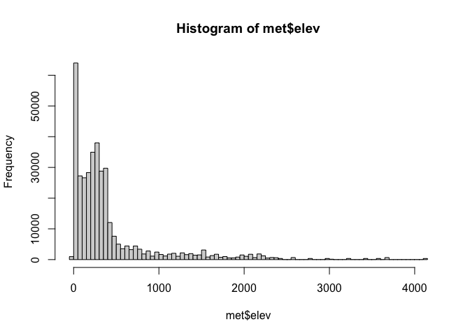
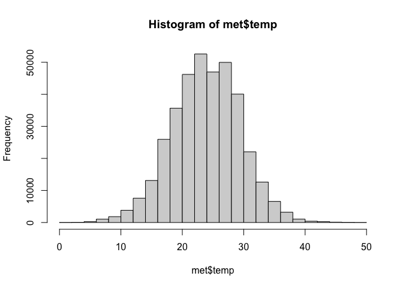
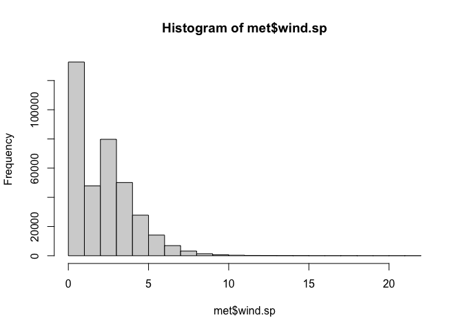

Lab 04
================
Yumeng Gao
2022-09-14

``` r
library(webshot)
webshot::install_phantomjs()
```

    ## It seems that the version of `phantomjs` installed is greater than or equal to the requested version.To install the requested version or downgrade to another version, use `force = TRUE`.

## 1. Read in the data

First download and then read in with data.table:fread()

``` r
library(R.utils)
```

    ## Loading required package: R.oo

    ## Loading required package: R.methodsS3

    ## R.methodsS3 v1.8.2 (2022-06-13 22:00:14 UTC) successfully loaded. See ?R.methodsS3 for help.

    ## R.oo v1.25.0 (2022-06-12 02:20:02 UTC) successfully loaded. See ?R.oo for help.

    ## 
    ## Attaching package: 'R.oo'

    ## The following object is masked from 'package:R.methodsS3':
    ## 
    ##     throw

    ## The following objects are masked from 'package:methods':
    ## 
    ##     getClasses, getMethods

    ## The following objects are masked from 'package:base':
    ## 
    ##     attach, detach, load, save

    ## R.utils v2.12.0 (2022-06-28 03:20:05 UTC) successfully loaded. See ?R.utils for help.

    ## 
    ## Attaching package: 'R.utils'

    ## The following object is masked from 'package:utils':
    ## 
    ##     timestamp

    ## The following objects are masked from 'package:base':
    ## 
    ##     cat, commandArgs, getOption, isOpen, nullfile, parse, warnings

``` r
library(data.table)
library(tidyverse)
```

    ## ── Attaching packages
    ## ───────────────────────────────────────
    ## tidyverse 1.3.2 ──

    ## ✔ ggplot2 3.3.6     ✔ purrr   0.3.4
    ## ✔ tibble  3.1.8     ✔ dplyr   1.0.9
    ## ✔ tidyr   1.2.0     ✔ stringr 1.4.0
    ## ✔ readr   2.1.2     ✔ forcats 0.5.1
    ## ── Conflicts ────────────────────────────────────────── tidyverse_conflicts() ──
    ## ✖ dplyr::between()   masks data.table::between()
    ## ✖ tidyr::extract()   masks R.utils::extract()
    ## ✖ dplyr::filter()    masks stats::filter()
    ## ✖ dplyr::first()     masks data.table::first()
    ## ✖ dplyr::lag()       masks stats::lag()
    ## ✖ dplyr::last()      masks data.table::last()
    ## ✖ purrr::transpose() masks data.table::transpose()

``` r
library(lubridate)
```

    ## 
    ## Attaching package: 'lubridate'
    ## 
    ## The following objects are masked from 'package:data.table':
    ## 
    ##     hour, isoweek, mday, minute, month, quarter, second, wday, week,
    ##     yday, year
    ## 
    ## The following objects are masked from 'package:base':
    ## 
    ##     date, intersect, setdiff, union

``` r
if (!file.exists("met_all.gz"))
  download.file(
    url = "https://raw.githubusercontent.com/USCbiostats/data-science-data/master/02_met/met_all.gz",
    destfile = "met_all.gz",
    method   = "libcurl",
    timeout  = 60
    )
met <- data.table::fread("met_all.gz")
```

## 2. Prepare the data

``` r
# Remove temperatures less than -17C
# Make sure there are no missing data in the key variables coded as 9999, 999, etc
met <- met[temp>-17] [elev == 9999.0, elev := NA]

# check no 9999s in other important variables
summary(met$temp)
```

    ##    Min. 1st Qu.  Median    Mean 3rd Qu.    Max. 
    ##   -3.00   19.60   23.50   23.59   27.80   56.00

``` r
summary(met$elev)
```

    ##    Min. 1st Qu.  Median    Mean 3rd Qu.    Max.    NA's 
    ##   -13.0   101.0   252.0   414.3   400.0  4113.0     182

``` r
summary(met$wind.sp)
```

    ##    Min. 1st Qu.  Median    Mean 3rd Qu.    Max.    NA's 
    ##    0.00    0.00    2.10    2.46    3.60   36.00   31743

Generate a date variable using the functions as.Date() (hint: You will
need the following to create a date paste(year, month, day, sep = “-”)).

``` r
met= met[ , ymd := as.Date(paste(year, month, day, sep = "-"))]
```

Using the data.table::week function, keep the observations of the first
week of the month.

``` r
met[, table(week(ymd))]
```

    ## 
    ##     31     32     33     34     35 
    ## 371544 520440 529571 526312 369337

``` r
met= met[week(ymd)==31]
```

Compute the mean by station of the variables temp, rh, wind.sp,
vis.dist, dew.point, lat, lon, and elev.

``` r
met[, .(
  temp= max(temp, na.rm=T),
  rh= max(rh, na.rm=T),
  wind.sp= max(wind.sp, na.rm=T),
  vis.dist= max(vis.dist, na.rm=T), 
  dew.point= max(dew.point, na.rm=T), 
  lat= max(lat, na.rm=T), 
  lon= max(lon, na.rm=T), 
  elev= max(elev, na.rm=T)
)]
```

    ##    temp  rh wind.sp vis.dist dew.point    lat     lon elev
    ## 1: 48.9 100    21.1   152888        29 48.941 -68.313 4113

``` r
met_avg= met[, .(
  temp= mean(temp, na.rm=T),
  rh= mean(rh, na.rm=T),
  wind.sp= mean(wind.sp, na.rm=T),
  vis.dist= mean(vis.dist, na.rm=T), 
  dew.point= mean(dew.point, na.rm=T), 
  lat= mean(lat, na.rm=T), 
  lon= mean(lon, na.rm=T), 
  elev= mean(elev, na.rm=T)
), by= 'USAFID']
```

Create a region variable for NW, SW, NE, SE based on lon = -98.00 and
lat = 39.71 degrees

Create a categorical variable for elevation as in the lecture slides

## 3. Use geom_violin to examine the wind speed and dew point temperature by region

## 4. Use geom_jitter with stat_smooth to examine the association between dew point temperature and wind speed by region

## 5. Use geom_bar to create barplots of the weather stations by elevation category coloured by region

## 6. Use stat_summary to examine mean dew point and wind speed by region with standard deviation error bars

## 7. Make a map showing the spatial trend in relative h in the US

## 8. Use a ggplot extension

## 

## 2. Check the dimensions, headers, footers. How many columns, rows are there?

``` r
dim(met)
```

    ## [1] 371544     31

``` r
head(met)
```

    ##    USAFID  WBAN year month day hour min  lat      lon elev wind.dir wind.dir.qc
    ## 1: 690150 93121 2019     8   1    0  56 34.3 -116.166  696      220           5
    ## 2: 690150 93121 2019     8   1    1  56 34.3 -116.166  696      230           5
    ## 3: 690150 93121 2019     8   1    2  56 34.3 -116.166  696      230           5
    ## 4: 690150 93121 2019     8   1    3  56 34.3 -116.166  696      210           5
    ## 5: 690150 93121 2019     8   1    4  56 34.3 -116.166  696      120           5
    ## 6: 690150 93121 2019     8   1    5  56 34.3 -116.166  696       NA           9
    ##    wind.type.code wind.sp wind.sp.qc ceiling.ht ceiling.ht.qc ceiling.ht.method
    ## 1:              N     5.7          5      22000             5                 9
    ## 2:              N     8.2          5      22000             5                 9
    ## 3:              N     6.7          5      22000             5                 9
    ## 4:              N     5.1          5      22000             5                 9
    ## 5:              N     2.1          5      22000             5                 9
    ## 6:              C     0.0          5      22000             5                 9
    ##    sky.cond vis.dist vis.dist.qc vis.var vis.var.qc temp temp.qc dew.point
    ## 1:        N    16093           5       N          5 37.2       5      10.6
    ## 2:        N    16093           5       N          5 35.6       5      10.6
    ## 3:        N    16093           5       N          5 34.4       5       7.2
    ## 4:        N    16093           5       N          5 33.3       5       5.0
    ## 5:        N    16093           5       N          5 32.8       5       5.0
    ## 6:        N    16093           5       N          5 31.1       5       5.6
    ##    dew.point.qc atm.press atm.press.qc       rh        ymd
    ## 1:            5    1009.9            5 19.88127 2019-08-01
    ## 2:            5    1010.3            5 21.76098 2019-08-01
    ## 3:            5    1010.6            5 18.48212 2019-08-01
    ## 4:            5    1011.6            5 16.88862 2019-08-01
    ## 5:            5    1012.7            5 17.38410 2019-08-01
    ## 6:            5    1012.7            5 20.01540 2019-08-01

``` r
tail(met)
```

    ##    USAFID  WBAN year month day hour min   lat      lon elev wind.dir
    ## 1: 726813 94195 2019     8   5   18  56 43.65 -116.633  741       NA
    ## 2: 726813 94195 2019     8   5   19  56 43.65 -116.633  741      360
    ## 3: 726813 94195 2019     8   5   20  56 43.65 -116.633  741       NA
    ## 4: 726813 94195 2019     8   5   21  56 43.65 -116.633  741       NA
    ## 5: 726813 94195 2019     8   5   22  56 43.65 -116.633  741      320
    ## 6: 726813 94195 2019     8   5   23  56 43.65 -116.633  741      320
    ##    wind.dir.qc wind.type.code wind.sp wind.sp.qc ceiling.ht ceiling.ht.qc
    ## 1:           9              V     1.5          5      22000             5
    ## 2:           5              N     2.1          5      22000             5
    ## 3:           9              V     2.1          5      22000             5
    ## 4:           9              V     2.1          5      22000             5
    ## 5:           5              N     3.1          5      22000             5
    ## 6:           5              N     2.6          5      22000             5
    ##    ceiling.ht.method sky.cond vis.dist vis.dist.qc vis.var vis.var.qc temp
    ## 1:                 9        N    14484           5       N          5 31.7
    ## 2:                 9        N    12875           5       N          5 33.3
    ## 3:                 9        N    16093           5       N          5 34.4
    ## 4:                 9        N    16093           5       N          5 36.1
    ## 5:                 9        N    16093           5       N          5 36.1
    ## 6:                 9        N    16093           5       N          5 36.7
    ##    temp.qc dew.point dew.point.qc atm.press atm.press.qc       rh        ymd
    ## 1:       5      11.7            5    1013.6            5 29.28255 2019-08-05
    ## 2:       5      12.8            5    1012.8            5 28.71968 2019-08-05
    ## 3:       5      12.8            5    1012.0            5 26.97045 2019-08-05
    ## 4:       5      11.7            5    1011.0            5 22.76944 2019-08-05
    ## 5:       5      11.1            5    1010.2            5 21.87511 2019-08-05
    ## 6:       5      12.8            5    1009.6            5 23.67832 2019-08-05

## 3. Take a look at the variables.

``` r
str(met)
```

    ## Classes 'data.table' and 'data.frame':   371544 obs. of  31 variables:
    ##  $ USAFID           : int  690150 690150 690150 690150 690150 690150 690150 690150 690150 690150 ...
    ##  $ WBAN             : int  93121 93121 93121 93121 93121 93121 93121 93121 93121 93121 ...
    ##  $ year             : int  2019 2019 2019 2019 2019 2019 2019 2019 2019 2019 ...
    ##  $ month            : int  8 8 8 8 8 8 8 8 8 8 ...
    ##  $ day              : int  1 1 1 1 1 1 1 1 1 1 ...
    ##  $ hour             : int  0 1 2 3 4 5 6 7 8 9 ...
    ##  $ min              : int  56 56 56 56 56 56 56 56 56 56 ...
    ##  $ lat              : num  34.3 34.3 34.3 34.3 34.3 34.3 34.3 34.3 34.3 34.3 ...
    ##  $ lon              : num  -116 -116 -116 -116 -116 ...
    ##  $ elev             : int  696 696 696 696 696 696 696 696 696 696 ...
    ##  $ wind.dir         : int  220 230 230 210 120 NA 320 10 320 350 ...
    ##  $ wind.dir.qc      : chr  "5" "5" "5" "5" ...
    ##  $ wind.type.code   : chr  "N" "N" "N" "N" ...
    ##  $ wind.sp          : num  5.7 8.2 6.7 5.1 2.1 0 1.5 2.1 2.6 1.5 ...
    ##  $ wind.sp.qc       : chr  "5" "5" "5" "5" ...
    ##  $ ceiling.ht       : int  22000 22000 22000 22000 22000 22000 22000 22000 22000 22000 ...
    ##  $ ceiling.ht.qc    : int  5 5 5 5 5 5 5 5 5 5 ...
    ##  $ ceiling.ht.method: chr  "9" "9" "9" "9" ...
    ##  $ sky.cond         : chr  "N" "N" "N" "N" ...
    ##  $ vis.dist         : int  16093 16093 16093 16093 16093 16093 16093 16093 16093 16093 ...
    ##  $ vis.dist.qc      : chr  "5" "5" "5" "5" ...
    ##  $ vis.var          : chr  "N" "N" "N" "N" ...
    ##  $ vis.var.qc       : chr  "5" "5" "5" "5" ...
    ##  $ temp             : num  37.2 35.6 34.4 33.3 32.8 31.1 29.4 28.9 27.2 26.7 ...
    ##  $ temp.qc          : chr  "5" "5" "5" "5" ...
    ##  $ dew.point        : num  10.6 10.6 7.2 5 5 5.6 6.1 6.7 7.8 7.8 ...
    ##  $ dew.point.qc     : chr  "5" "5" "5" "5" ...
    ##  $ atm.press        : num  1010 1010 1011 1012 1013 ...
    ##  $ atm.press.qc     : int  5 5 5 5 5 5 5 5 5 5 ...
    ##  $ rh               : num  19.9 21.8 18.5 16.9 17.4 ...
    ##  $ ymd              : Date, format: "2019-08-01" "2019-08-01" ...
    ##  - attr(*, ".internal.selfref")=<externalptr>

## 4. Take a closer look at the key variables.

``` r
table(met$year)
```

    ## 
    ##   2019 
    ## 371544

``` r
table(met$day)
```

    ## 
    ##     1     2     3     4     5 
    ## 73681 74036 74983 74559 74285

``` r
table(met$hour)
```

    ## 
    ##     0     1     2     3     4     5     6     7     8     9    10    11    12 
    ## 15759 14836 14854 15383 15068 15076 16263 15752 16022 16355 16371 15938 16329 
    ##    13    14    15    16    17    18    19    20    21    22    23 
    ## 15256 15160 15384 15090 15001 15941 15159 15160 15406 14992 14989

``` r
summary(met$temp)
```

    ##    Min. 1st Qu.  Median    Mean 3rd Qu.    Max. 
    ##    0.10   20.60   24.00   24.09   28.00   48.90

``` r
summary(met$elev)
```

    ##    Min. 1st Qu.  Median    Mean 3rd Qu.    Max.    NA's 
    ##     -12     101     254     415     401    4113      31

``` r
summary(met$wind.sp)
```

    ##    Min. 1st Qu.  Median    Mean 3rd Qu.    Max.    NA's 
    ##   0.000   0.000   2.100   1.956   3.100  21.100    6232

OR

``` r
met[,summary(temp)]
```

    ##    Min. 1st Qu.  Median    Mean 3rd Qu.    Max. 
    ##    0.10   20.60   24.00   24.09   28.00   48.90

Replace elevations with 9999 as NA.

``` r
met[met$elev==9999.0] <- NA
summary(met$elev)
```

    ##    Min. 1st Qu.  Median    Mean 3rd Qu.    Max.    NA's 
    ##     -12     101     254     415     401    4113      31

The weather station with highest elevation is at 4113 meters.

Remove temp below -40 Celsius.

``` r
met <- met[temp>-40]
met2 <- met[order(temp)]
head(met2)
```

    ##    USAFID  WBAN year month day hour min    lat      lon elev wind.dir
    ## 1: 722191  3721 2019     8   5   18  35 33.929  -78.075    8      190
    ## 2: 725846 93201 2019     8   1   12  15 39.320 -120.139 1798       NA
    ## 3: 725846 93201 2019     8   1   12  55 39.320 -120.140 1798       NA
    ## 4: 725846 93201 2019     8   1   13  15 39.320 -120.139 1798       NA
    ## 5: 725846 93201 2019     8   2   12  55 39.320 -120.139 1798       NA
    ## 6: 725846 93201 2019     8   2   13  15 39.320 -120.139 1798       NA
    ##    wind.dir.qc wind.type.code wind.sp wind.sp.qc ceiling.ht ceiling.ht.qc
    ## 1:           5              V     3.6          5      22000             5
    ## 2:           9              C     0.0          5      22000             5
    ## 3:           9              C     0.0          1      22000             1
    ## 4:           9              C     0.0          5      22000             5
    ## 5:           9              C     0.0          5      22000             5
    ## 6:           9              C     0.0          5      22000             5
    ##    ceiling.ht.method sky.cond vis.dist vis.dist.qc vis.var vis.var.qc temp
    ## 1:                 9        N    16093           5       N          5  0.1
    ## 2:                 9        N    16093           5       N          5  2.0
    ## 3:                 9        N    16093           1       9          9  2.0
    ## 4:                 9        N    16093           5       N          5  2.0
    ## 5:                 9        N    16093           5       N          5  2.0
    ## 6:                 9        N    16093           5       N          5  2.0
    ##    temp.qc dew.point dew.point.qc atm.press atm.press.qc        rh        ymd
    ## 1:       5     -13.7            5        NA            9  34.95745 2019-08-05
    ## 2:       5       1.0            5        NA            9  93.18257 2019-08-01
    ## 3:       1       2.0            1        NA            9 100.00000 2019-08-01
    ## 4:       5       1.0            5        NA            9  93.18257 2019-08-01
    ## 5:       C       0.0            C        NA            9  86.77534 2019-08-02
    ## 6:       5       0.0            5        NA            9  86.77534 2019-08-02

## 5. Check the data against an external data source.

``` r
met <- met[temp>-15]
met2 <- met[order(temp)]
head(met2)
```

    ##    USAFID  WBAN year month day hour min    lat      lon elev wind.dir
    ## 1: 722191  3721 2019     8   5   18  35 33.929  -78.075    8      190
    ## 2: 725846 93201 2019     8   1   12  15 39.320 -120.139 1798       NA
    ## 3: 725846 93201 2019     8   1   12  55 39.320 -120.140 1798       NA
    ## 4: 725846 93201 2019     8   1   13  15 39.320 -120.139 1798       NA
    ## 5: 725846 93201 2019     8   2   12  55 39.320 -120.139 1798       NA
    ## 6: 725846 93201 2019     8   2   13  15 39.320 -120.139 1798       NA
    ##    wind.dir.qc wind.type.code wind.sp wind.sp.qc ceiling.ht ceiling.ht.qc
    ## 1:           5              V     3.6          5      22000             5
    ## 2:           9              C     0.0          5      22000             5
    ## 3:           9              C     0.0          1      22000             1
    ## 4:           9              C     0.0          5      22000             5
    ## 5:           9              C     0.0          5      22000             5
    ## 6:           9              C     0.0          5      22000             5
    ##    ceiling.ht.method sky.cond vis.dist vis.dist.qc vis.var vis.var.qc temp
    ## 1:                 9        N    16093           5       N          5  0.1
    ## 2:                 9        N    16093           5       N          5  2.0
    ## 3:                 9        N    16093           1       9          9  2.0
    ## 4:                 9        N    16093           5       N          5  2.0
    ## 5:                 9        N    16093           5       N          5  2.0
    ## 6:                 9        N    16093           5       N          5  2.0
    ##    temp.qc dew.point dew.point.qc atm.press atm.press.qc        rh        ymd
    ## 1:       5     -13.7            5        NA            9  34.95745 2019-08-05
    ## 2:       5       1.0            5        NA            9  93.18257 2019-08-01
    ## 3:       1       2.0            1        NA            9 100.00000 2019-08-01
    ## 4:       5       1.0            5        NA            9  93.18257 2019-08-01
    ## 5:       C       0.0            C        NA            9  86.77534 2019-08-02
    ## 6:       5       0.0            5        NA            9  86.77534 2019-08-02

## 6. Calculate summary statistics

``` r
elev <- met[elev==max(elev)]
summary(elev)
```

    ##      USAFID         WBAN          year         month          day     
    ##  Min.   : NA   Min.   : NA   Min.   : NA   Min.   : NA   Min.   : NA  
    ##  1st Qu.: NA   1st Qu.: NA   1st Qu.: NA   1st Qu.: NA   1st Qu.: NA  
    ##  Median : NA   Median : NA   Median : NA   Median : NA   Median : NA  
    ##  Mean   :NaN   Mean   :NaN   Mean   :NaN   Mean   :NaN   Mean   :NaN  
    ##  3rd Qu.: NA   3rd Qu.: NA   3rd Qu.: NA   3rd Qu.: NA   3rd Qu.: NA  
    ##  Max.   : NA   Max.   : NA   Max.   : NA   Max.   : NA   Max.   : NA  
    ##       hour          min           lat           lon           elev    
    ##  Min.   : NA   Min.   : NA   Min.   : NA   Min.   : NA   Min.   : NA  
    ##  1st Qu.: NA   1st Qu.: NA   1st Qu.: NA   1st Qu.: NA   1st Qu.: NA  
    ##  Median : NA   Median : NA   Median : NA   Median : NA   Median : NA  
    ##  Mean   :NaN   Mean   :NaN   Mean   :NaN   Mean   :NaN   Mean   :NaN  
    ##  3rd Qu.: NA   3rd Qu.: NA   3rd Qu.: NA   3rd Qu.: NA   3rd Qu.: NA  
    ##  Max.   : NA   Max.   : NA   Max.   : NA   Max.   : NA   Max.   : NA  
    ##     wind.dir   wind.dir.qc        wind.type.code        wind.sp   
    ##  Min.   : NA   Length:0           Length:0           Min.   : NA  
    ##  1st Qu.: NA   Class :character   Class :character   1st Qu.: NA  
    ##  Median : NA   Mode  :character   Mode  :character   Median : NA  
    ##  Mean   :NaN                                         Mean   :NaN  
    ##  3rd Qu.: NA                                         3rd Qu.: NA  
    ##  Max.   : NA                                         Max.   : NA  
    ##   wind.sp.qc          ceiling.ht  ceiling.ht.qc ceiling.ht.method 
    ##  Length:0           Min.   : NA   Min.   : NA   Length:0          
    ##  Class :character   1st Qu.: NA   1st Qu.: NA   Class :character  
    ##  Mode  :character   Median : NA   Median : NA   Mode  :character  
    ##                     Mean   :NaN   Mean   :NaN                     
    ##                     3rd Qu.: NA   3rd Qu.: NA                     
    ##                     Max.   : NA   Max.   : NA                     
    ##    sky.cond            vis.dist   vis.dist.qc          vis.var         
    ##  Length:0           Min.   : NA   Length:0           Length:0          
    ##  Class :character   1st Qu.: NA   Class :character   Class :character  
    ##  Mode  :character   Median : NA   Mode  :character   Mode  :character  
    ##                     Mean   :NaN                                        
    ##                     3rd Qu.: NA                                        
    ##                     Max.   : NA                                        
    ##   vis.var.qc             temp       temp.qc            dew.point  
    ##  Length:0           Min.   : NA   Length:0           Min.   : NA  
    ##  Class :character   1st Qu.: NA   Class :character   1st Qu.: NA  
    ##  Mode  :character   Median : NA   Mode  :character   Median : NA  
    ##                     Mean   :NaN                      Mean   :NaN  
    ##                     3rd Qu.: NA                      3rd Qu.: NA  
    ##                     Max.   : NA                      Max.   : NA  
    ##  dew.point.qc         atm.press    atm.press.qc       rh           ymd     
    ##  Length:0           Min.   : NA   Min.   : NA   Min.   : NA   Min.   :NA   
    ##  Class :character   1st Qu.: NA   1st Qu.: NA   1st Qu.: NA   1st Qu.:NA   
    ##  Mode  :character   Median : NA   Median : NA   Median : NA   Median :NA   
    ##                     Mean   :NaN   Mean   :NaN   Mean   :NaN   Mean   :NaN  
    ##                     3rd Qu.: NA   3rd Qu.: NA   3rd Qu.: NA   3rd Qu.:NA   
    ##                     Max.   : NA   Max.   : NA   Max.   : NA   Max.   :NA

``` r
met[elev==max(elev,na.rm=T), summary(wind.sp)]
```

    ##    Min. 1st Qu.  Median    Mean 3rd Qu.    Max.    NA's 
    ##   0.000   2.600   4.600   4.918   6.700  11.800      26

``` r
met[elev==max(elev,na.rm=T), .(
  temp_wind= cor(temp, wind.sp, use= "complete"),
  temp_hour= cor(temp, hour, use= "complete"),
  wind.sp_day= cor(wind.sp, day, use= "complete"),
  wind.sp_hour= cor(wind.sp, hour, use= "complete")
)]
```

    ##     temp_wind temp_hour wind.sp_day wind.sp_hour
    ## 1: -0.4237022 0.4855399   -0.131383   -0.2909175

## 7. Exploratory graphs

``` r
hist(met$elev, breaks=100)
```

<!-- -->

``` r
hist(met$temp)
```

<!-- -->

``` r
hist(met$wind.sp)
```

<!-- -->

``` r
if (!require(leaflet)){
  install.packages("leaflet")
}
```

    ## Loading required package: leaflet

``` r
library(leaflet)
library(dplyr)
leaflet(elev) %>%
  addProviderTiles('OpenStreetMap') %>% 
  addCircles(lat=~lat,lng=~lon, opacity=1, fillOpacity=1, radius=100)
```

<!-- -->
