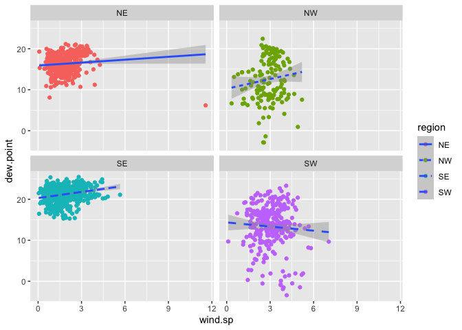

Lab 04
================
Yumeng Gao
2022-09-14

``` r
library(webshot)
webshot::install_phantomjs()
```

    ## It seems that the version of `phantomjs` installed is greater than or equal to the requested version.To install the requested version or downgrade to another version, use `force = TRUE`.

## 1. Read in the data

First download and then read in with data.table:fread()

``` r
library(R.utils)
```

    ## Loading required package: R.oo

    ## Loading required package: R.methodsS3

    ## R.methodsS3 v1.8.2 (2022-06-13 22:00:14 UTC) successfully loaded. See ?R.methodsS3 for help.

    ## R.oo v1.25.0 (2022-06-12 02:20:02 UTC) successfully loaded. See ?R.oo for help.

    ## 
    ## Attaching package: 'R.oo'

    ## The following object is masked from 'package:R.methodsS3':
    ## 
    ##     throw

    ## The following objects are masked from 'package:methods':
    ## 
    ##     getClasses, getMethods

    ## The following objects are masked from 'package:base':
    ## 
    ##     attach, detach, load, save

    ## R.utils v2.12.0 (2022-06-28 03:20:05 UTC) successfully loaded. See ?R.utils for help.

    ## 
    ## Attaching package: 'R.utils'

    ## The following object is masked from 'package:utils':
    ## 
    ##     timestamp

    ## The following objects are masked from 'package:base':
    ## 
    ##     cat, commandArgs, getOption, isOpen, nullfile, parse, warnings

``` r
library(data.table)
library(tidyverse)
```

    ## ── Attaching packages
    ## ───────────────────────────────────────
    ## tidyverse 1.3.2 ──

    ## ✔ ggplot2 3.3.6     ✔ purrr   0.3.4
    ## ✔ tibble  3.1.8     ✔ dplyr   1.0.9
    ## ✔ tidyr   1.2.0     ✔ stringr 1.4.0
    ## ✔ readr   2.1.2     ✔ forcats 0.5.1
    ## ── Conflicts ────────────────────────────────────────── tidyverse_conflicts() ──
    ## ✖ dplyr::between()   masks data.table::between()
    ## ✖ tidyr::extract()   masks R.utils::extract()
    ## ✖ dplyr::filter()    masks stats::filter()
    ## ✖ dplyr::first()     masks data.table::first()
    ## ✖ dplyr::lag()       masks stats::lag()
    ## ✖ dplyr::last()      masks data.table::last()
    ## ✖ purrr::transpose() masks data.table::transpose()

``` r
library(lubridate)
```

    ## 
    ## Attaching package: 'lubridate'
    ## 
    ## The following objects are masked from 'package:data.table':
    ## 
    ##     hour, isoweek, mday, minute, month, quarter, second, wday, week,
    ##     yday, year
    ## 
    ## The following objects are masked from 'package:base':
    ## 
    ##     date, intersect, setdiff, union

``` r
if (!file.exists("met_all.gz"))
  download.file(
    url = "https://raw.githubusercontent.com/USCbiostats/data-science-data/master/02_met/met_all.gz",
    destfile = "met_all.gz",
    method   = "libcurl",
    timeout  = 60
    )
met <- data.table::fread("met_all.gz")
```

## 2. Prepare the data

``` r
# Remove temperatures less than -17C
# Make sure there are no missing data in the key variables coded as 9999, 999, etc
met <- met[temp>-17] [elev == 9999.0, elev := NA]

# check no 9999s in other important variables
summary(met$temp)
```

    ##    Min. 1st Qu.  Median    Mean 3rd Qu.    Max. 
    ##   -3.00   19.60   23.50   23.59   27.80   56.00

``` r
summary(met$elev)
```

    ##    Min. 1st Qu.  Median    Mean 3rd Qu.    Max.    NA's 
    ##   -13.0   101.0   252.0   414.3   400.0  4113.0     182

``` r
summary(met$wind.sp)
```

    ##    Min. 1st Qu.  Median    Mean 3rd Qu.    Max.    NA's 
    ##    0.00    0.00    2.10    2.46    3.60   36.00   31743

Generate a date variable using the functions as.Date() (hint: You will
need the following to create a date paste(year, month, day, sep = “-”)).

``` r
met= met[ , ymd := as.Date(paste(year, month, day, sep = "-"))]
```

Using the data.table::week function, keep the observations of the first
week of the month.

``` r
met[, table(week(ymd))]
```

    ## 
    ##     31     32     33     34     35 
    ## 371544 520440 529571 526312 369337

``` r
met= met[week(ymd)==31]
```

Compute the mean by station of the variables temp, rh, wind.sp,
vis.dist, dew.point, lat, lon, and elev.

``` r
met[, .(
  temp= max(temp, na.rm=T),
  rh= max(rh, na.rm=T),
  wind.sp= max(wind.sp, na.rm=T),
  vis.dist= max(vis.dist, na.rm=T), 
  dew.point= max(dew.point, na.rm=T), 
  lat= max(lat, na.rm=T), 
  lon= max(lon, na.rm=T), 
  elev= max(elev, na.rm=T)
)]
```

    ##    temp  rh wind.sp vis.dist dew.point    lat     lon elev
    ## 1: 48.9 100    21.1   152888        29 48.941 -68.313 4113

``` r
met_avg= met[, .(
  temp= mean(temp, na.rm=T),
  rh= mean(rh, na.rm=T),
  wind.sp= mean(wind.sp, na.rm=T),
  vis.dist= mean(vis.dist, na.rm=T), 
  dew.point= mean(dew.point, na.rm=T), 
  lat= mean(lat, na.rm=T), 
  lon= mean(lon, na.rm=T), 
  elev= mean(elev, na.rm=T)
), by= 'USAFID']
```

Create a region variable for NW, SW, NE, SE based on lon = -98.00 and
lat = 39.71 degrees

``` r
met_avg= met_avg[ , region := fifelse(lon>= -98 & lat> 39.71, "NE",
                 fifelse(lon< -98 & lat> 39.71, "NW",
                 fifelse(lon< -98 & lat<= 39.71, "SW","SE")))
     ]
table(met_avg$region)
```

    ## 
    ##  NE  NW  SE  SW 
    ## 484 146 649 296

Create a categorical variable for elevation as in the lecture slides

``` r
met_avg[, elev_cat := fifelse(elev >252, "high", "low")]
```

## 3. Use geom_violin to examine the wind speed and dew point temperature by region

``` r
met_avg[!is.na(region)] %>% 
  ggplot() + 
  geom_violin(mapping = aes(x = 1, y = dew.point, color=region, fill= region)) + 
  facet_wrap(~ region, nrow = 1)
```

<!-- --> the highest
dew point temp is in se

``` r
met_avg[!is.na(region) & !is.na(wind.sp)] %>% 
  ggplot() + 
  geom_violin(mapping = aes(x = 1, y = wind.sp, color=region, fill= region)) + 
  facet_wrap(~ region, nrow = 2)
```

<!-- --> ne has the
highest wind speed

## 4. Use geom_point with stat_smooth to examine the association between dew point temperature and wind speed by region

Colour points by region Make sure to deal with NA category Fit a linear
regression line by region Describe what you observe in the graph

``` r
met_avg[!is.na(region) & !is.na(wind.sp)] %>% 
  ggplot(mapping = aes(x = wind.sp, y = dew.point)) + 
  geom_point(mapping= aes(color= region)) + 
  geom_smooth(method= lm, mapping= aes(linetype= region))+
  facet_wrap(~ region, nrow = 2)
```

    ## `geom_smooth()` using formula 'y ~ x'

<!-- -->

## 5. Use geom_bar to create barplots of the weather stations by elevation category coloured by region

Bars by elevation category using position=“dodge” Change colours from
the default. Colour by region using scale_fill_brewer see this Create
nice labels on axes and add a title Describe what you observe in the
graph Make sure to deal with NA

## 6. Use stat_summary to examine mean dew point and wind speed by region with standard deviation error bars

Make sure to remove NA Use fun.data=“mean_sdl” in stat_summary Add
another layer of stats_summary but change the geom to “errorbar” (see
the help). Describe the graph and what you observe Dew point temperature
is… Wind speed is…

``` r
met_avg[!is.na(dew.point)] %>%
  ggplot(mapping = aes(x = region, y = dew.point)) + 
  stat_summary(fun.data= mean_sdl, geom= "errorbar")+
  stat_summary(fun.data= mean_sdl)
```

<!-- -->

``` r
#to show both means and error bars
```

## 7. Make a map showing the spatial trend in relative h in the US

Make sure to remove NA

Use leaflet()

Make a colour palette with custom colours

Use addMarkers to include the top 10 places in relative h (hint: this
will be useful rank(-rh) \<= 10)

Add a legend

Describe trend in RH across the US

``` r
# Generating a color palette
library(leaflet)
rh.pal <- colorNumeric(c('darkgreen','goldenrod','brown'), domain=met_avg$rh)
rh.pal
```

    ## function (x) 
    ## {
    ##     if (length(x) == 0 || all(is.na(x))) {
    ##         return(pf(x))
    ##     }
    ##     if (is.null(rng)) 
    ##         rng <- range(x, na.rm = TRUE)
    ##     rescaled <- scales::rescale(x, from = rng)
    ##     if (any(rescaled < 0 | rescaled > 1, na.rm = TRUE)) 
    ##         warning("Some values were outside the color scale and will be treated as NA")
    ##     if (reverse) {
    ##         rescaled <- 1 - rescaled
    ##     }
    ##     pf(rescaled)
    ## }
    ## <bytecode: 0x7feb2acdf038>
    ## <environment: 0x7feb2ace1968>
    ## attr(,"colorType")
    ## [1] "numeric"
    ## attr(,"colorArgs")
    ## attr(,"colorArgs")$na.color
    ## [1] "#808080"

Use addMarkers to include the top 10 places in relative h (hint: this
will be useful rank(-rh) \<= 10)

``` r
top10rh= met_avg[rank(-rh) <=10][1:10]
```

``` r
rhmap <- leaflet(met_avg) %>% 
  # The looks of the Map
  addProviderTiles('CartoDB.Positron') %>% 
  # Some circles
  addCircles(
    lat = ~lat, lng=~lon,
                                                  # HERE IS OUR PAL!
    label = ~paste0(rh), color = ~ rh.pal(rh),
    opacity = 1, fillOpacity = 1, radius = 500
    ) %>%
  # And a pretty legend
  addLegend('bottomleft', pal=rh.pal, values=met_avg$rh,
          title='Releative Hunid.', opacity=1)
rhmap
```

<!-- -->

## 8. Use a ggplot extension
